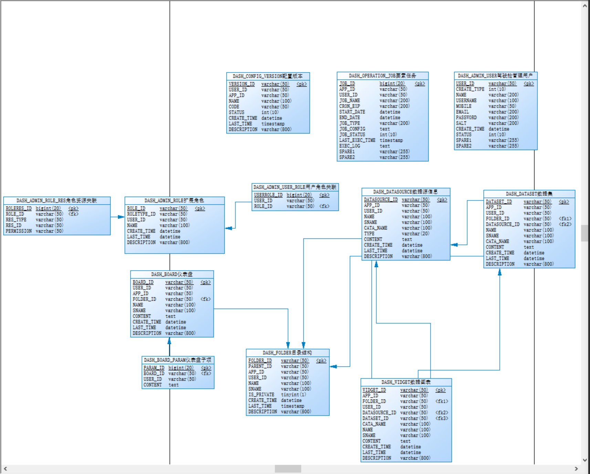
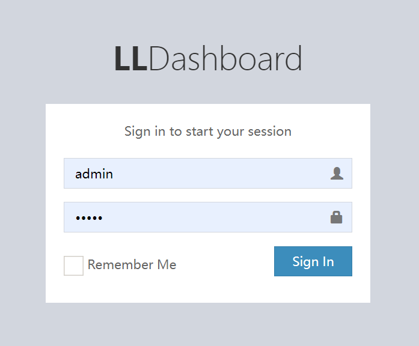
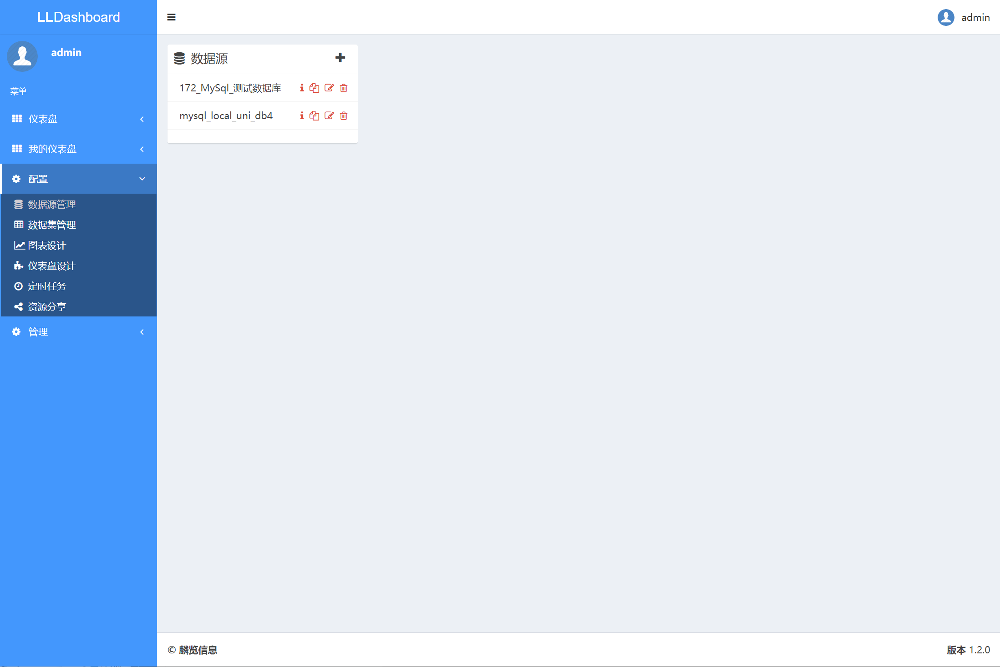
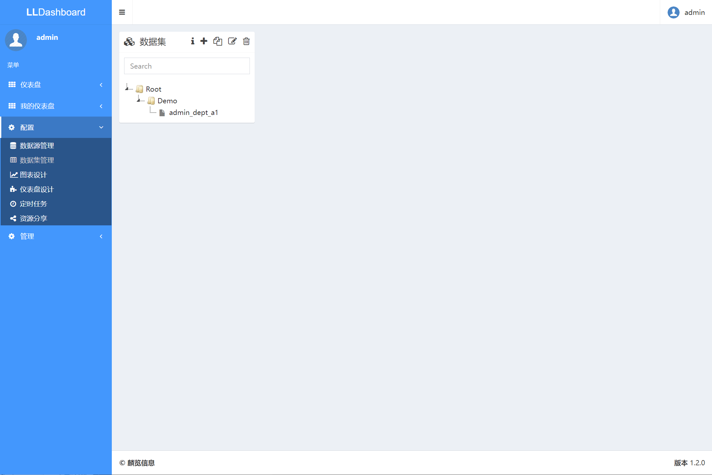
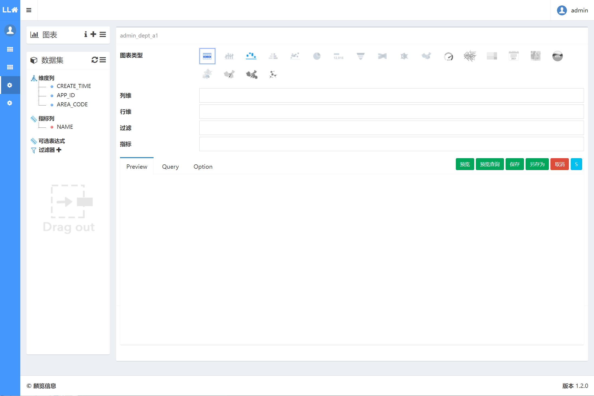

# java-tools-dashboard
JAVA代码数据驾驶舱应用，可通过JDBC、SOLR、ELASTIC等数据源，创建数据集，分析数据图表，生产数据看板

## 项目说明
```
- 智能运行数据驾驶舱系统，可对多种数据来源进行接入实现SQL分析，利用聚类方法实现对目标数据的展示阅读；通过十多类Echarts图表实现对数据的最佳展示驾驶舱体验。
- 智能运行数据驾驶舱系统，可接入的数据源包括：关系型数据库如Oracle、Mysql、达梦数据库、Db2等，文本数据库如XLS、XLSX、JSON文本，支撑Apache的Solr全文检索数据库等类型。
- 智能运行数据驾驶舱系统，功能包括：资源目录维护、数据源配置和管理、数据集信息管理、图表功能分析、仪表盘功能设计、结合综合展示要求制定WEB页面模式的动态驾驶舱界面和共享分发要求。
- 智能运行数据驾驶舱系统，基于Spring MVC框架，后台采用AdminLte和Bootstrap组件进行支撑，对图表的分发采用PhantomJS进行渲染处理，可动态的配置数据仪表盘展现形式和要求。
1、主要功能：主要结合城市运行的各类结构化数据进行多种数据来源接入，通过SQL编辑器和分析器，利用聚类方法实现对目标数据的展示阅读；通过十多类Echarts图表实现对数据的最佳展示驾驶舱体验。功能包括：资源目录维护、数据源配置和管理、数据集信息管理、图表功能分析、仪表盘功能设计、结合综合展示要求制定WEB页面模式的动态驾驶舱界面和共享分发要求。
2、技术特点：软件采用Java语言进行编程，运行效率高，稳定安全可靠，并且支持可跨平台部署，具有较好的移植性。在界面展现上采用基于Spring MVC框架，后台采用AdminLte和Bootstrap组件进行支撑，对图表的分发采用PhantomJS进行渲染处理，可动态的配置数据仪表盘展现形式和要求。可接入的数据源包括：关系型数据库如Oracle、Mysql、达梦数据库、Db2等，文本数据库如XLS、XLSX、JSON文本，支持Solr或elasti全文检索数据库等类型。成熟开放的三层体系架构可以降低应用系统各个模块的业务逻辑之间的耦合性，易于扩展。以配置化的方式提供后续扩展功能，无需硬编码，提供了极强的适应性和扩展能力。
```

## 版本历史

```
2.3.0       2023-12-27  独立版本表名称修改为DASH_前缀
                        solr资源移动到dashboard内，solr版本升级为8.2.0
                        调整引用的基础包信息及版本，完善和规范化调整README.md文件
                        
2.2.1       2023-05-17  调整xml错误信息
2.2.0       2022-05-25  修改人员、角色权限相关bug

2.1.0       2020-10-30  基于前期版本进行调整
2.0.0       2020-05-30  对前期版本进行优化，加强angularjs相关开发模式

1.5         2019-05-11  将工程名称调整为java-dashboard，相应的修改部分js内controller名称
            2019-05-10  对功能和文件进行调整，对类名称进行调整
            对controller内的入口方法进行调整
            修改部分配置文件的拦截策略

1.4         2019-05-08  对产品定位进行调整，修改为tools模式，对文件资源目录进行统一梳理，对pom文件进行调整
            2019-04-08  删除view_dashboard_category的相关代码

1.3         2018-12-09    为了保持产品的完整性，增加view_dashboard_dataset和view_dashobard_datasource，

1.2         2018-7-11   新增dataset表和DashDataset类及相关方法和资源
            将view_admin_user内的user_id和sysuser_id合并，修改相应方法
            2018-7-6    增加provider的实现相关类，目前提供六类数据源类型
            增加H2的清理任务执行器和服务，定时清理处理
            2018-6-26   对pom文件规范性进行调整，包括版本，引用，排除
            2018-6-25   对新增folder和version功能后的页面、数据库、方法等进行更新调整

1.1         2018-6-16   将datasource表和DSE_datasource整合，将category_id修改为folder_id，并且增加dashboard_folder表和类
            2018-5-5    调整数据库为Oracle，修改Category功能增加category_id
            2018-3-3    在开源项目基础上，进行框架提炼

1.0         2018-2-5    沿用开源项目现有资源

```

## DB-Change

[建库脚本](sql/create_db.sql)
[插入用户和目录配置信息](sql/initial.sql)
```

2023-12-27  表名称和类对象规范化调整

2019-05-08  对board部分进行统一调整
            对folder_id、widget_id、board_id、config_id调整为Varchar类型
            
2019-04-08  删除view_dashboard_category表
2019-02-08  对folderIds的类型进行调整，调整为Long类型
2018-12-08  为了保持产品的完整性，增加view_dashboard_dataset和view_dashobard_datasource
2018-7-11   将view_dashboard_dataset修改为dash_dataset，并且将dataset_id修改为varchar
            将view_admin_user内的user_id和sysuser_id合并
2018-6-20   暂时保留view_dashboard_category表

2018-6-16   将view_dashobard_datasource表和DSE_DATASOURCE整合
            增加表view_dashboard_folder和view_config_version
            view_dashboard_board内的category_id调整为FOLDER_ID
2018-3-30   生成SS工程内的全部表结构，并进行数据初始化
            view_表13张
2017-12-15  完成view_的表结构，生成表
```

## 技术路径
### 软件架构
```
1. 基于Springboot MVC框架
2. 后台采用AngelarJS进行支撑
```

### 安装教程
1. 下载代码
2. 在mysql8.0内运行 [建库脚本](sql/create_db.sql)
3. 在mysql8内初始化数据 [插入用户和目录配置信息](sql/initial.sql)
4. 使用Myeclipse或IDEA InterliJ工具，添加tomcat服务，配置服务参数，启动后进入登录页

## 应用效果
</br>默认用户名为admin，密码为admin




## 参与贡献
1.  Fork 本仓库
2.  新建 Feat_1.0.0 分支
3.  提交代码
```
git config user.name linlaninfo
git config user.email linlanio@qq.com
```
4. 新建 Pull Request
5. 创建和提交tag
```
创建
git tag -a v2.3.0 -m "调整引用的基础包信息及版本，完善和规范化调整README.md文件"
查看
git tag
提交
git push origin --tags
删除
git tag -d v2.3.0
```
6. 其他

## 联系我们
```
网站：https://www.linlan.io
邮箱：contact@linlan.io
```
